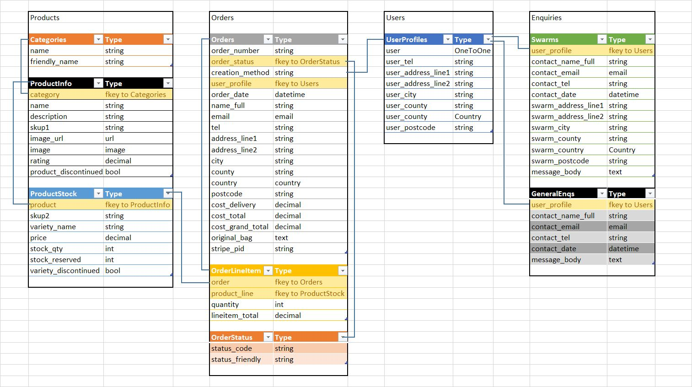

# Stonecroft Bees

Stonecroft Bees will be a website for a commercial beekeeping business; which sells bee products, such as honey and beeswax, and beekeeping supplies, such as hives, tools, and books.

The site will be a full featured e-commerce site, allowing both registered and unregistered purchases by customers, and the site admin to administrate products and users, and manage stock levels.

A demo for the site can be found hosted on Heroku at [https://ak87-milestone4.herokuapp.com/](https://ak87-milestone4.herokuapp.com/)

## UX

### Intended Audience

The site will be intended to be used by customers, both unregistered and registered, to allow them to view products, add products to a shopping basket, and make purchases using Stripe. Registered users will also be able to make a profile to view their previous orders, and store their address and contact information etc to make checking out quicker.

Site Owners will be able to manage user profiles, add product information, and view and manage stock levels, and view and manage outstanding orders.

### User Stories

| ID  | As A/An    | I want to...                                                      | So I can...                                                                           |
| --- | ---------- | ----------------------------------------------------------------- | ------------------------------------------------------------------------------------- |
|     |            | **_Viewing and Navigation_**                                      |                                                                                       |
| 1   | Shopper    | View list of products                                             | Find something to purchase                                                            |
| 2   | Shopper    | View details of product                                           | See Price, Description, Image, and Sizes i/a                                          |
| 3   | Shopper    | See list of deals, clearance items, etc                           | Take advantage of deals and save money                                                |
| 4   | Shopper    | See my cart's total at any time                                   | Avoid spending too much                                                               |
|     |            | **_Registration and User Accounts_**                              |                                                                                       |
| 5   | Reg User   | Register for an account                                           | Save my delivery details and order history                                            |
| 6   | Reg User   | Quickly login/out                                                 | Access my account                                                                     |
| 7   | Reg User   | Request a password reset                                          | receive and email to reset my password in case I forget it                            |
| 8   | Reg User   | Receive an email confirming my registration                       | Verify my account was registered successfully                                         |
| 9   | Reg User   | Access my user profile                                            | View my order history, manage my personal details                                     |
|     |            | **_Sorting and Searching_**                                       |                                                                                       |
| 10  | Shopper    | Sort the list of available products                               | See the products in a list sorted by price, rating, quantity available etc            |
| 11  | Shopper    | Sort a category of products                                       | See the products in a category sorted by name, price, rating, etc                     |
| 12  | Shopper    | Sort multiple categories simultaneously                           | Find the best rated or best priced across broad categories such as 'books' or 'honey' |
| 13  | Shopper    | Search for product                                                | Find a specific item I wish to purchase                                               |
| 14  | Shopper    | View a list of search results                                     | See if the product I want is available to purchase                                    |
|     |            | **_Purchasing and Checkout_**                                     |                                                                                       |
| 15  | Shopper    | Easily select the size and quantity whilst purchasing an item     | Ensure I don't accidentally select the wrong product, quantity, or size               |
| 16  | Shopper    | View items in my basket                                           | See what items are in my basket at a glance to ensure the items are correct           |
| 17  | Shopper    | Adjust the quantity of individual items in my bag                 | Easily adjust the amount of an item I intended to purchase (including removing)       |
| 18  | Shopper    | Easily enter my payment information                               | Checkout quickly, without hassle                                                      |
| 19  | Shopper    | Feel my payment and personal information is secure                | Provide the needed payment and personal information, and feel it is handled safely    |
| 20  | Shopper    | View confirmation of order before completing purchase             | Verify I haven't made any mistakes                                                    |
| 21  | Shopper    | Receive confirmation email after checking out                     | To keep my own record of the purchase                                                 |
|     |            | **_Admin and Store Management_**                                  |                                                                                       |
| 22  | Site Owner | Add a product                                                     | Add new products to my store                                                          |
| 23  | Site Owner | Edit/update a product                                             | Change the price, description, images etc of a product                                |
| 24  | Site Owner | Delete a product                                                  | Remove items that aren't for sale anymore                                             |
|     |            | **_Stock Control_**                                               |                                                                                       |
| 25  | Site Owner | Keep records of available stock levels                            | Manage the level of stock                                                             |
| 26  | Site Owner | Automatically have marked reserved when purchased                 | Prevent shoppers buying more stock than available                                     |
| 27  | Site Owner | Automatically have reserved stocked unmarked when order cancelled | Allow that stock to be re-available for purchase by other shoppers                    |
| 28  | Site Owner | Stock to subtract when order marked as dispatched                 | Have stock levels on system match stock levels in warehouse                           |
| 29  | Site Owner | Get a printable invoice                                           | So I know what items to pick for an order                                             |
|     |            | **_Messaging_**                                                   |                                                                                       |
| 30  | Public     | Report on sightings of bee swarms                                 | Alert local beekeepers of the location of a swarm                                     |
| 31  | Beekeeper  | Get email alerts of swarms reported                               | Collect them and get free bees                                                        |
| 32  | Shopper    | Send enquiries to site owner                                      | To get answers to questions                                                           |

### Wireframes 

For Desktop wireframes see [docs/wireframes/desktop.pdf](docs/wireframes/desktop.pdf)

For Mobile wireframes see [docs/wireframes/mobile.pdf](docs/wireframes/mobile.pdf)

### Datamap

[Original propose Datamap](docs/datamap/proposed_datamap.jpg)

[Actual Datamap](docs/datamap/actual_datamap.jpg)

## Features

### Existing Features

#### A secure login system (provided by allauth) to:
- Register for accounts, login/out, handle emails for confirmation and password resets
- User Profiles to:
  - store their contact and delivery information, to prefill forms with for convenience
  - maintain an order history

#### A navbar which provides easy access on any page to:
- Login/Register/View User Profile
- Frequent admin functions
- Shopping cart with a display of the current total
- Search products
- Access product categories
- Access the contact systems

#### A Product Database which:
- Stores details of Products sold such as name, category, etc
- Has Product Lines for different colour varieties of products or bulk casings
  - Each line allows it's own price and name, and tracks its own stock levels
- Products list display which displays products filtered by category and allows sorting by various options
- Product details which present the image, name, price etc of the product and its lines to the customers
- Makes use of Django Admin pages to manage creating and editing of products/lines
- Product/Lines soft delete via a '***_discontinued' field, to maintain data integrity and references with order history, etc

#### Stock Keeping:
- Each Product has Product Lines which track the quantity in stock and the amount of stock reserved
- When a customer completes an order stock is reserved on that Line
- The available stock (Quantity - Reserved) is checked at various points to ensure customer can not buy more than is available
  - Product Details: 
    - The available stock is passed to the selector and displayed for the customer
    - This is passed to the quantity selector, which uses it to set its max levels
  - Bag: 
    - Checked when adding to bag, or adjusting current quantity
    - When viewing bag, JavaScript highlights the fields which have more selected than available
  - Checkout: 
    - Once as a pre-check before the user sees the form, returns them to Bag screen to make adjustments if needed
    - When purchase submitted a final penultimate check is made during order creation (or backup Webhook)
      - This is for the very rare instances that someone has bought the stock between the time the customer enters the checkout and submits the purchase
      - In this case the payment intent is cancelled so the user isn't charged, and the customer is returned to the bag page with error details

#### Bag
- Bag total is visible on every page via a navbar element
- Provides a page for the customer to:
  - view items in their bag
  - alter the quantity of items in the bag
  - remove items from the bag
- Validates that quantity selected is actually available (see Stock Keeping.3)

#### Checkout 
- Uses the Stripe payment system to provide safe and secure checking out
- Allows purchases by both registered and unregistered customers
- Orders are stored in the database
- Uses Stripe Webhooks to create Order record if something goes wrong between the customer purchasing the order and the backend creating the order
- Payment Intents are deferred until Ordered created on DB either via POST backend or Webhook
- Orders have a status:
  - Processing - when order is initially created on DB
  - Pending - set once Webhook has been received to confirm payment successfully
  - Picking - order has been sent for picking in warehouse (FOR FUTURE USE)
  - Dispatched - order has been dispatched to customer (FOR FUTURE USE)
  - Cancelled - Order has been cancelled (FOR FUTURE USE)
- Customer receives email to confirm order

#### Contact
- Provides a contact form for general enquiries
- Provides a contact form for reporting bee swarms
- Both send email receipt to submitter
- Swarms sends email to specified email address (likely an email address group) with details of the swarm
- Messages are stored in the database for future use

### Features Left to Implement

For following User Stories were cut for time, but would be good to implement later:

| ID  | As A/An    | I want to...                                                      | So I can...                                                                           |
| --- | ---------- | ----------------------------------------------------------------- | ------------------------------------------------------------------------------------- |
| 3   | Shopper    | See list of deals, clearance items, etc                           | Take advantage of deals and save money                                                |
| 27  | Site Owner | Automatically have reserved stocked unmarked when order cancelled | Allow that stock to be re-available for purchase by other shoppers                    |
| 28  | Site Owner | Stock to subtract when order marked as dispatched                 | Have stock levels on system match stock levels in warehouse                           |
| 29  | Site Owner | Get a printable invoice                                           | So I know what items to pick for an order                                             |

#### Future Ideas
##### Stock Reservation
As currently implemented the focus was primary a defensive one to prevent customers trying to purchase more stock than available.  
Although this was implemented with the intent of also giving a good User Experience, there is still room for improvement.

Specifically the final checkout check, which occurs after the customer has already entered their payment information and confirmed the purchase, 
this could be annoying (and concerning) to the customer (though should be rare after the previous checks, and the customer isn't actually charged).

A better system would probably have some sort of soft reservations when a user adds the item to their bag, 
but this would need to make a system to clear or expire those reservations when the user abandons the purchase. 

##### Stock Control / Ordering
The current system is baby steps, it tracks the quantity in the warehouse and updates the amount reserved when purchased.  
But a full system would need to create picking tickets, track when dispatched, and allow the user to cancel their order and return the stock to the available pool.

##### User Profile
There's currently no way for the user to set their name fields, this would be highly useful for a full program.

##### Custom admin pages
To save time I made use of Django's built in admin panel system to create forms to manage database tables, 
they are highly functional and get the job done, but do take the user away from the main site. Even if they are 
a staff user, it would still be a better experience to have customised admin pages that match the rest of the site.

## Technologies Used

###### Languages

- [HTML5](https://www.w3.org/standards/webdesign/htmlcss)
	- Latest version of the Hyper Text Markup Language, used to write the markup language the browser interprets to display the webpage elements.
- [CSS](https://www.w3.org/standards/webdesign/htmlcss)
	- Used to create style sheets to adjust the styles of HTML elements.
- [JavaScript](https://developer.mozilla.org/en/JavaScript)
  - Used to provide interactive and dynamic content on the front end.
- [Python 3](https://www.python.org/)
  - Used to provide backend functionality such as database interaction and web app functions.

###### Frameworks & Libraries

- [Bootstrap 4.5.0](https://materializecss.com/)
  - CSS framework that provides a collection of pre-built styles to quickly develop a fully responsive website.
- [JQuery](https://jquery.com)
  - A JavaScript framework to simplify DOM manipulation. Required by Materialize.
- [Django](https://www.djangoproject.com/)
  - Django is a high-level Python Web framework that encourages rapid development and clean, pragmatic design.
- [Django-Allauth](https://www.intenct.nl/projects/django-allauth/)
  - A Django app that provides a pre-made user authentication system, using this ensures the login components of this project are well developed and secure.
- [Django-Crispy-Forms](https://github.com/django-crispy-forms/django-crispy-forms)
  - Allows the use of forms that are clean and crispy, without having to write HTML yourself.
- [Boto3](https://boto3.amazonaws.com/v1/documentation/api/latest/index.html)
  - The AWS SDK to allow the use of AWS S3 Buckets

###### Platforms

- [Github](https://github.com/)
  - Hosting service for Git Software Version Controlled repositories. 
  - Also provides GitHub Projects - a kanban board system I used to keep track of development tasks.
- [Heroku](https://www.heroku.com/)
  - Cloud-based web hosting service for dynamic websites.
- [AWS S3](https://aws.amazon.com/s3/)
  - AWS's Simple Storage Service provides 'buckets' to store static and media files for the site, as Heroku doesn't allow persistent ones.
- [Stripe](https://stripe.com/)
  - Online payment processor who provides APIs and frameworks to integrate the shopping components of this site with Stripe's safe and secure payment system.

###### Tools

- [Inkscape](https://inkscape.org/)
    - A vector based drawing program. Used to create the site's Logo/Favicon.
- [Gitpod](https://gitpod.io/)
	- Provides an online Linux container workspace that includes the Theia web based IDE, and allows the rapid setup of a development environment.
- [Google Chrome](https://www.google.com/chrome/)
	- Web browser. Includes Dev Tools which provide information on how the elements are rendered, what style rules are applied, and allows editing of the HTML and CSS to see their effects live in the view pane. 

###### Validators

- [W3C Validator](https://validator.w3.org/)
	- Validates HTML markup files. Checks for errors in syntax such as unclosed tags or unneeded close tags.
- [W3C Jigsaw](https://jigsaw.w3.org/css-validator/)
	- Validates CSS files for syntax errors.
- [Cornflakes Linter](https://marketplace.visualstudio.com/items?itemName=kevinglasson.cornflakes-linter)
  - Validates Python code for syntax errors and checks for compliance with PEP8 styling rules, on the fly within VSCode/Gitpod.

## Testing

Testing documentation is located in a separate [TESTING.md document](docs/TESTING.md) located in the docs folder.

## Deployment

This section should describe the process you went through to deploy the project to a hosting platform (e.g. GitHub Pages or Heroku).

In particular, you should provide all details of the differences between the deployed version and the development version, if any, including:

- Different values for environment variables (Heroku Config Vars)?
- Different configuration files?
- Separate git branch?

In addition, if it is not obvious, you should also describe how to run your code locally.

### Heroku Deployment

#### Predeployment 

- Create a fork of the Stonecroft Bee's github repo
- Create a public S3 Bucket on Amazon Web Services (consult AWS's manual for how to do this)
  - Download the 'new_user_credentials.csv' to a safe place after making the user
- Set up an email service that allows SMTP outgoing mail, e.g. Gmail 
  - Create an address for general outgoing/incoming mail (the contact address)
  - Create an mailing list address for the Swarms service
- Create a Stripe Account
  - Create a webhook to '[Herokuapp Address]/checkout/wh/'  
    (e.g. 'https://ak87-milestone4.herokuapp.com/checkout/wh/')

#### Heroku
- Create a new app
- Under Resources > Add-ons: Provision a new Postgres database
- Settings > Config Vars: Add the following enviromental variables

| Key                     | Description                                           | Remarks                                                                                     |
|-------------------------|-------------------------------------------------------|---------------------------------------------------------------------------------------------|
| AWS_ACCESS_KEY_ID       | The Access key ID of the AWS static files user        | From new_user_credentials.csv                                                               |
| AWS_S3_REGION_NAME      | The AWS region name of the S3 bucket                  | E.g. 'eu-west-2'                                                                            |
| AWS_SECRET_ACCESS_KEY   | The Secret Access key of the AWS static files user    | From new_user_credentials.csv                                                               |
| AWS_STORAGE_BUCKET_NAME | The name of the AWS S3 bucket                         |                                                                                             |
| DATABASE_URL            | The URL of the Postgres DB                            | Should be auto-populated after provisioning the Postgres DB in Heroku                       |
| DEVELOPMENT             | Whether to run the server in Debug mode or not        | 'True' to run in debug mode. Case sensitive!                                                |
| EMAIL_HOST              | The host address of your email webserver              | E.g. 'smtp.gmail.com'                                                                       |
| EMAIL_HOST_PASSWORD     | Password for your email host                          |                                                                                             |
| EMAIL_HOST_USER         | Username for your email host                          |                                                                                             |
| EMAIL_PORT              | Port of email server                                  | E.g. 587                                                                                    |
| EMAIL_SWARMS            | Address of the Swarms email address                   |                                                                                             |
| EMAIL_USE_TLS           | If Email provider requires the use of TLS             |                                                                                             |
| HEROKU_HOSTNAME         | Hostname of the Heroku app                            | E.g. ak87-milestone4.herokuapp.com                                                          |
| SECRET_KEY              | The Django secret key                                 | Use a keygen (e.g. https://djecrety.ir/) to generate                                        |
| STRIPE_PUBLIC_KEY       | The Stripe public key                                 |                                                                                             |
| STRIPE_SECRET_KEY       | The Stripe secret key                                 |                                                                                             |
| STRIPE_WH_SECRET        | The Stripe Webhook secret key                         |                                                                                             |
| USE_AWS                 | Whether to use AWS or local storage for static files  | Only presence is checked, any value is considered True  !!Required to be on for Heroku!! |
| USE_EMAIL               | Whether to use real emails or print emails to console | Only presence is checked, any value is considered True                                      |

- Deploy
  - Deployment Method: Github
  - Connect to your Github fork for the Stonecroft Bees repo
  - Manual Deployment: Choose Live branch
  - (Optional) Set up automatic deployments from Live branch 
- Heroku CLI Run (or Web Interface > Other > Run Console):
  1. Python3 manage.py migrate
  2. Python3 manage.py loaddata OrderStatus
  3. Python3 manage.py loaddata Category
  4. (Optional) Python3 manage.py loaddata Sample_ProductInfo
  5. (Optional) Python3 manage.py loaddata Sample_ProductStock
  6. Python3 manage.py createsuperuser

#### Post Deployment

- The Static files will have been collected and pushed the S3 bucket during the build (check build logs for success)
- The Media files will not, copy these to a 'media' folder in the root of the S3 bucket manually through the AWS S3 web interface or cli
- Go to [HEROKU_HOSTNAME]/admin/ and log in with the created Super User
  - Accounts: Emails Addresses: 
    - Check email for super user exists, if not add it
    - Check 'Verified' and 'Primary' are ticked
  - Sites: Sites:
    - Change example.com
      - Domain name: The [HEROKU_HOSTNAME]
      - Display name: Something friendly, e.g. Stonecroft Bees

## Credits

### Content

- No text resources were sampled from external sources

### Media

- The photos used in this site were obtained from ...
  - swarm.jpg sampled from [Buzz About Bees](https://www.buzzaboutbees.net/swarmingbees.html)
  - bees.jpg from [Undark](https://undark.org/2016/05/24/evolving-a-better-honey-bee-how-wild-bees-resist-the-varroa-mite/)
  - noimage.png taken from Code Institute course materials
  - logo.svg original work by me, Andrew Kenworthy

### Acknowledgements

- I received inspiration for this project, and based the code, from Code Institute's 'Full Stack Frameworks With Django' course material. 
